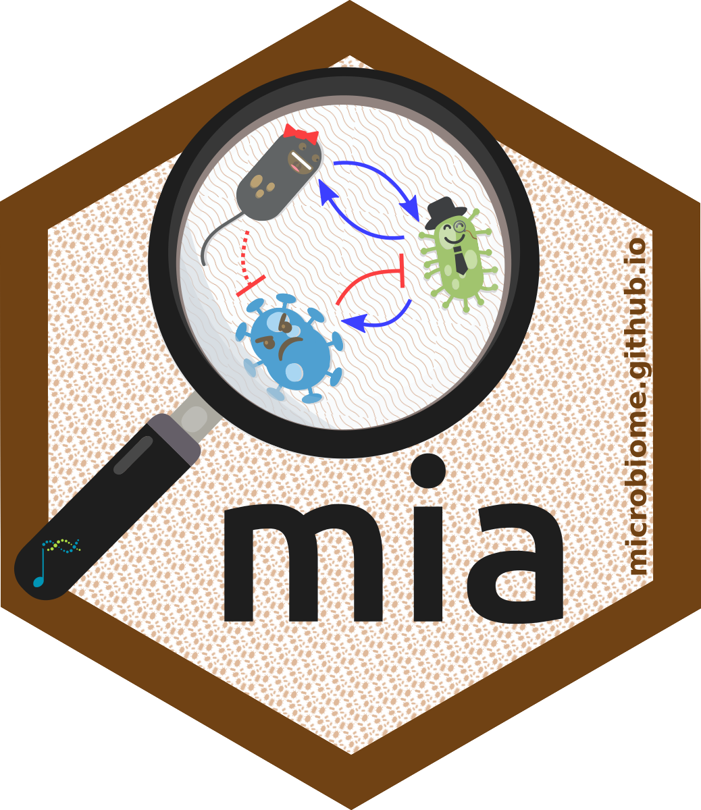

# Orchestrating Microbiome Analysis workshop 

Learn how Bioconductor ecosystem can be harnessed in your microbiome
research. This tutorial provide you an easy start to
Orchestrating Microbiome Analysis with Bioconductor (OMA) framework which
is covered in detail in
[the OMA book](https://bioconductor.org/books/release/OMA/)

The OMA framework is built around the _TreeSummarizedExperiment_ data container,
which not only ensures full interoperability with the extensive
_SummarizedExperiment_ ecosystem but also provides enhanced support for
scalable, multi-table microbiome studies.
